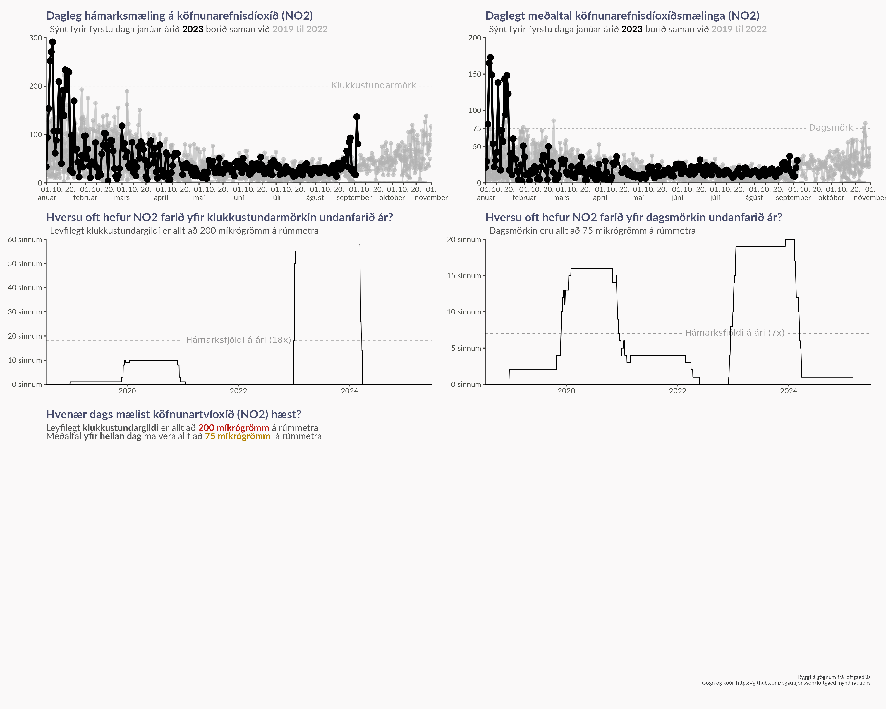

<!-- README.md is generated from README.Rmd. Please edit that file -->

# Loftgæði í Reykjavík

Þessi kóði les gögn frá [loftgaedi.is](www.loftgaedi.is) fyrir allar
mælistöðvar í Reykjavíkurborg og teiknar myndir til að bera saman magn
köfnunarefnisdíoxíðs (N02) í loftinu fyrstu mánuði ársins frá 2019 til
2023.

Skjalið `make_results.R` getur séð um að útbúa niðurstöðurnar með því að

1.  Ef kóðinn hefur aldrei verið keyrður keyrist skráin `R/get_data.R`.
    Þá eru öll gögnin sótt og vistuð í `Data/loftgaedi_reykjavik.csv`
2.  Ef kóðinn hefur verið keyrður áður eru gögnin nú þegar til og þá
    keyrist skráin `R/update_data.R`. Þá eru bara nýjustu tölur sóttar
    og þeim bætt við í gögnin.
3.  Skráin `R/make_figures.R` er svo keyrð, en hún keyrir aðrar skrár
    sem sjá um að útbúa myndirnar sem eru síðan vistaðar í möppunni
    `Figures`

Þessi keyrsla er keyrð sjálfkrafa samkvæmt tímatöflu með Github Actions
Workflow sem er skilgreing í `.github/workflows/schedule-commit.yaml`.

Helsta útkoma úr þessum kóða er myndin `Figures/combined_image.png` sem
sést hér að neðan

